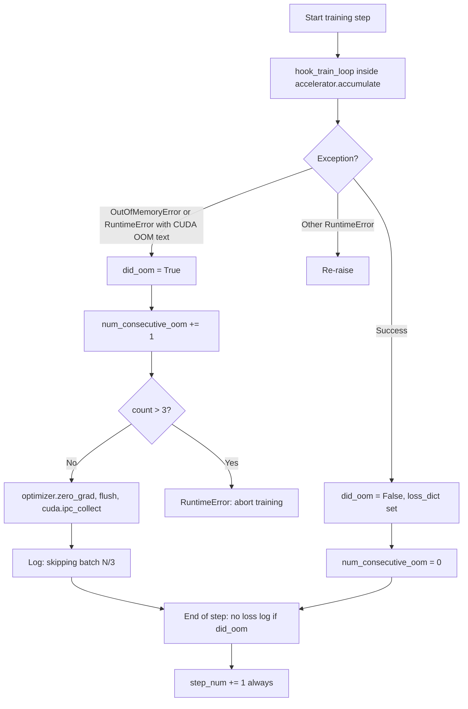

# Spec: skip training step on OOM (reference: ai-toolkit)

This document describes **batch/step skipping on CUDA OOM** (pattern from [ostris/ai-toolkit](https://github.com/ostris/ai-toolkit)) and how it is wired in rengu-flow. For user-facing config, see [Training loop (user)](../user/training-loop-and-eval.md#oom-step-skip).

Pony Diffusion V7 (AuraFlow) LoRA training is officially documented with **SimpleTuner**, which does **not** expose this same “skip up to 3 OOM batches” loop; the behavior below comes from **ai-toolkit** and matches reports such as [ai-toolkit#463](https://github.com/ostris/ai-toolkit/issues/463).

## Problem statement

During diffusion finetuning, peak VRAM is not constant across steps:

- Resolution / aspect bucket changes (e.g. 512 → 1024).
- Video or multi-frame batches (WAN I2V).
- Sampling or checkpoint saves that temporarily load extra modules.
- Fragmentation after many steps (allocator cannot satisfy a large allocation even when “free” VRAM looks sufficient).

A single `torch.cuda.OutOfMemoryError` on one batch would otherwise **abort the entire run**. The reference implementation **catches OOM around the training forward/backward**, **discards gradients for that step**, **frees allocator state**, and **continues** until a safety limit is hit.

This is distinct from:

| Mechanism | Where | What it skips |
|-----------|--------|----------------|
| **OOM batch skip (this spec)** | ai-toolkit `BaseSDTrainProcess` | Whole training step when CUDA OOM |
| **DeepSpeed `skipped_steps`** | DeepSpeed FP16/AMP optimizer | Optimizer update when **gradient overflow** (loss scale), not CUDA OOM |
| **GenericOptim `skip_invalid_grads`** | diffusion-pipe / rengu-flow vendor | Per-parameter update when grad is Inf/NaN |
| **Loss spike skip** | Ad-hoc patterns (e.g. MLOps tutorials) | Batch when `loss > k × rolling_avg` (not in ai-toolkit core loop) |

## Reference implementation

**Repository:** `ostris/ai-toolkit`  
**File:** `jobs/process/BaseSDTrainProcess.py`  
**Class:** `BaseSDTrainProcess`  
**State:** `self.num_consecutive_oom` (initialized to `0` in `__init__`)

### Control flow



### Detection

OOM is treated as OOM if either:

1. `torch.cuda.OutOfMemoryError` is raised, or  
2. `RuntimeError` is raised and `"CUDA out of memory"` appears in `str(e)`.

All other `RuntimeError` values propagate (real bugs are not swallowed).

### Recovery actions (on OOM)

When `did_oom` is true:

1. Increment `num_consecutive_oom`.
2. If `num_consecutive_oom > 3`, raise  
   `RuntimeError("OOM during training step 3 times in a row, aborting training")`.
3. Otherwise:
   - `optimizer.zero_grad(set_to_none=True)` — drop partial grads from the failed step.
   - `flush()` — project memory helper (cache / GC hooks used elsewhere in ai-toolkit).
   - `torch.cuda.ipc_collect()` — release IPC-related CUDA allocations.
   - Print a highly visible banner:  
     `# OOM during training step, skipping batch {n}/3 #`.

When `did_oom` is false:

- Reset `num_consecutive_oom = 0`.

### What is *not* done on skip

- **No optimizer step** — `hook_train_loop` did not complete successfully inside `accumulate`.
- **No loss metrics** for that step — logging paths guard with `if not did_oom and loss_dict is not None` (older builds had a bug logging `loss_dict` after OOM; see [issue #463](https://github.com/ostris/ai-toolkit/issues/463)).
- **No backward guarantee** — if OOM happens mid-backward, behavior depends on PyTorch/accelerate; the intent is to zero grads and continue.

### Step counter behavior

The outer loop is `for step in range(start_step_num, train_config.steps)`. At the end of each iteration:

- `self.step_num = step + 1` runs **even when the batch was skipped**.

So a skipped OOM batch still **consumes one entry from `train_config.steps`** (the global step budget advances). The dataloader may or may not advance depending on whether `get_batch` ran before OOM; typically OOM occurs inside `hook_train_loop`, so the **same problematic sample can appear again** on the next step unless the dataset order moves on.

### Configuration

There are **no TOML/YAML flags** for this behavior in ai-toolkit. Constants are **hard-coded**:

| Constant | Value | Meaning |
|----------|-------|---------|
| Max consecutive OOMs before abort | `3` | Fourth consecutive OOM aborts the job |
| Counter reset | On any successful step | One good step clears the streak |

Operational mitigations (documented in ai-toolkit issues, not in this loop):

- Lower resolution / batch size / `low_vram` presets.
- `skip_first_sample` / `disable_sampling` to avoid OOM during preview generation.
- More VRAM or `PYTORCH_CUDA_ALLOC_CONF=expandable_segments:True` for fragmentation.

## Why this shows up with “large” steps

Users often describe the failure as a step that is “too big”:

- **Large spatial size** → activation memory scales with tokens/patches (AuraFlow / DiT at 1024² is much heavier than 512²).
- **Large effective batch** (accumulation × frames) → peak during backward.
- **Spiky VRAM** after eval/sample/save — the next training step hits OOM even though average usage looked fine ([ai-toolkit#387](https://github.com/ostris/ai-toolkit/issues/387) style reports).

The skip logic does **not** inspect loss magnitude or diffusion timestep `t`; it only reacts to **CUDA OOM exceptions**.

## Relation to AuraFlow / Pony V7

| Project | AuraFlow training | OOM step skip |
|---------|-------------------|---------------|
| diffusion-pipe | `models/auraflow.py`, commit `f1d5d30` | No |
| rengu-flow | `sdxl`, `cosmos_predict2` in registry | Yes (single-GPU; see below) |
| SimpleTuner | [AURAFLOW quickstart](https://github.com/bghira/SimpleTuner/blob/main/documentation/quickstart/AURAFLOW.md), recommended by [pony-v7-base](https://huggingface.co/purplesmartai/pony-v7-base) | No equivalent loop; GPU “circuit breaker” **fails the job** on OOM |
| ai-toolkit | Used for many flow/video models; same `BaseSDTrainProcess` loop | **Yes** (this spec) |

If the remembered behavior was “training kept going after OOM on huge resolutions,” it likely came from **ai-toolkit** (or a fork), not from the first diffusion-pipe AuraFlow merge.

## Implementation in rengu-flow

**Status:** Implemented for **single-GPU** training (`pipeline_stages = 1`). Code: `rengu_flow/utils/oom_skip.py`, wired in `rengu_flow/main.py` around `train_batch`. Example: `examples/config_oom_skip.toml`.

**Limitation:** Multi-GPU / pipeline stages &gt; 1 are not synchronized on OOM; an OOM on one rank can desynchronize collectives. Prefer disabling `[train.oom_skip]` for multi-GPU until a broadcast skip flag exists.

Design aligned with ai-toolkit:

### Config (optional block)

```toml
[train.oom_skip]
enabled = true
max_consecutive = 3
clear_cache_on_skip = true   # empty_cuda_cache + ipc_collect
```

| Key | Type | Default | Description |
|-----|------|---------|-------------|
| `enabled` | bool | `false` | Enable OOM catch-and-continue around `train_batch`. |
| `max_consecutive` | int | `3` | Abort after this many **consecutive** OOM skips. |
| `clear_cache_on_skip` | bool | `true` | Call CUDA cache flush helpers after skip. |

### Integration point

Wrap the call in `rengu_flow/main.py` `_run_training` where the loop currently does:

```python
loss = model_engine.train_batch(iterator).item()
```

```python
try:
    loss = model_engine.train_batch(iterator).item()
except Exception as e:
    if not is_cuda_oom(e):
        raise
    handle_oom_skip(oom_skip_state, model_engine, ...)
    oom_skip_state.record_skip()
    continue  # no loss log; step/examples still advance
```

### Distributed requirements

With DeepSpeed pipeline / multi-GPU:

- All ranks must **agree** to skip the step (OOM on one rank must not desynchronize the pipeline). Options:
  - Broadcast a `skip_step` flag from the rank that caught OOM before any collective, or
  - Treat OOM as fatal in multi-GPU (document as limitation in v1).

### Metrics

- TensorBoard: `train/oom_skip` (total skips), `train/consecutive_oom` on skip when a writer is active.
- Skipped steps do not call `log_training_step` (no `train/loss` for that step).

### Tests (fast, no GPU)

- `tests/test_oom_skip.py` — `is_cuda_oom`, counter reset/abort, `handle_oom_skip` zeros optimizer grads.

## References

- [ostris/ai-toolkit `BaseSDTrainProcess.py`](https://github.com/ostris/ai-toolkit/blob/main/jobs/process/BaseSDTrainProcess.py) — lines ~2170–2196 (OOM handling), ~2337–2340 (step increment).
- [ai-toolkit issue #463](https://github.com/ostris/ai-toolkit/issues/463) — user logs showing `skipping batch 1/3`, `2/3`, `3/3` then abort.
- [PyTorch Lightning #5243](https://github.com/Lightning-AI/pytorch-lightning/issues/5243) — DDP must all-reduce a skip flag if returning `None` from `training_step` (relevant for rengu-flow multi-GPU design).
- [DeepSpeed `skipped_steps`](https://github.com/microsoft/DeepSpeed/blob/master/deepspeed/runtime/engine.py) — FP16 overflow skip (different trigger).
