# Train your first Anima LoRA — a quick A→Z with Poet

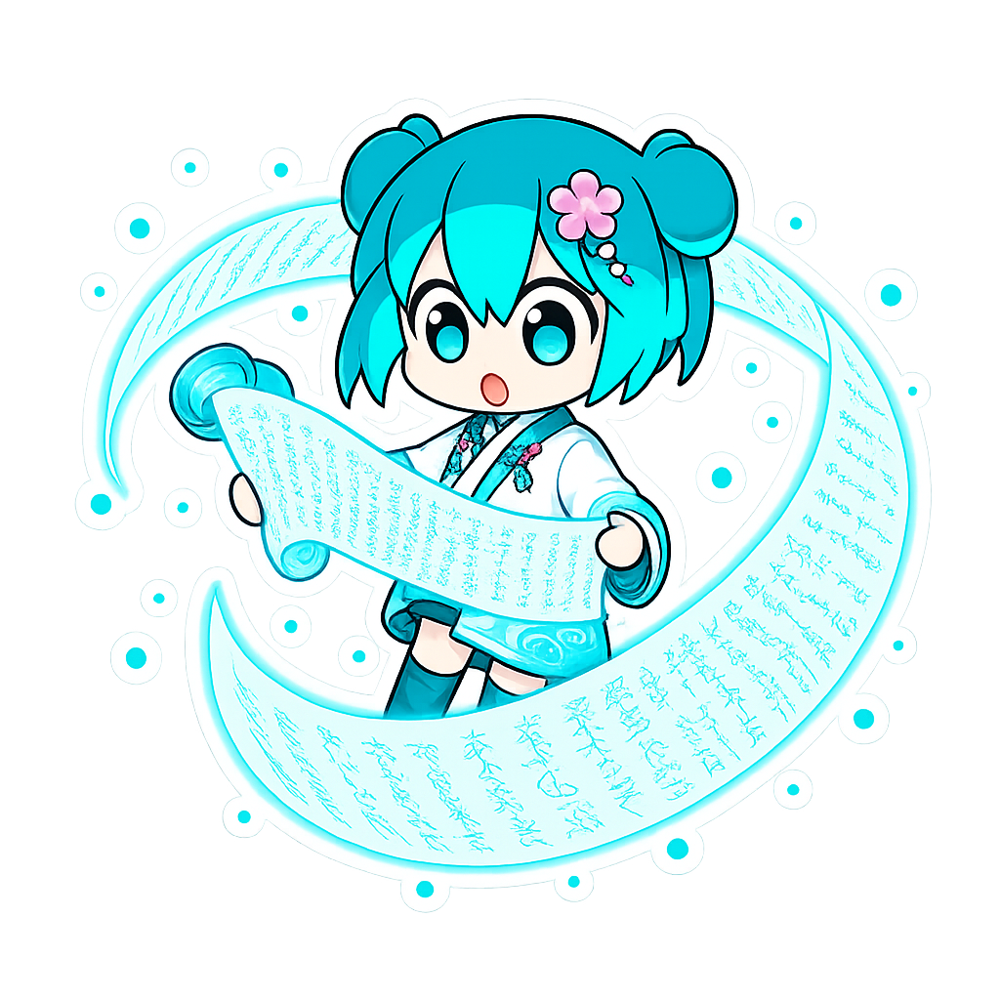

> Hi — I'm **Poet**, Rengu Flow's mascot. Small confession to break the ice: I was *painted by this
> very tool* (the Anima checkpoint, through Rengu Flow's own preview path). So I'm literally about to
> teach you how to make… more of me. They did **not** program me for the existential part. ☕
>
> This is a **smoke run**: 12 images, **one epoch**, start to finish. Not a final LoRA — a *taste*,
> so you learn every screen without waiting hours. Let's link the first verse.

---

## 0. What you need

- **Linux/WSL2 or native Windows**, an **NVIDIA GPU** (this run fits in ~6 GB at 512px), recent
  driver for **CUDA 13**.
- **[uv](https://docs.astral.sh/uv/)** on your PATH (it installs Python + the venv for you).
- For the web UI: **Node.js ≥ 22** (the frontend builds with it).
- An **Anima / Cosmos Predict2** checkpoint bundle: the main DiT, the Qwen image VAE, and the Qwen3
  text encoder.

---

## 1. Install & start the UI

From the repo root:

```bash
./rengu init        # set up the venv (base stack)
./rengu ui start    # install the UI bundle, build it, serve at http://127.0.0.1:8765
```

That's genuinely it. You **don't** pre-install model extras — Rengu Flow's auto-installer pulls
whatever a step needs, when it needs it: the **Cosmos/Anima** stack when your config calls for it,
the **tagger** the first time you tag. `init` for the base, `ui start` if you want the panel.

`ui start` even **builds the web bundle for you** the first run if it's missing. The one thing it
*can't* auto-install is **Node.js ≥ 22** — the system dependency it needs to compile the frontend.
Install Node once; everything else takes care of itself.

> 💬 Power-user aside: don't hand-run `uv sync --extra X` to "add" something — that's an *exact*
> sync and it drops the extras you didn't list. Let `init` and the auto-installer manage it.

This is the landing page — **Runs**. The top bar shows live CPU/RAM/GPU, so you always know what your
card is doing.

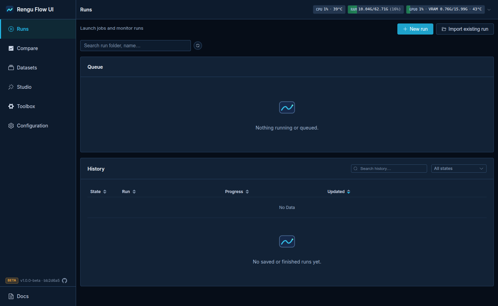

---

## 2. Tag the images → that *is* your dataset

I, uh… *borrowed* twelve little images for us. Don't tell anyone )? …fine, they're **CC0** and fully
attributed — I'm a *law-abiding* gremlin. Drop your own folder of images in; **no captions needed**,
the tagger writes them.

Open **Studio** — tagging, captioning, watermark cleanup, and a bulk tag editor all live here.

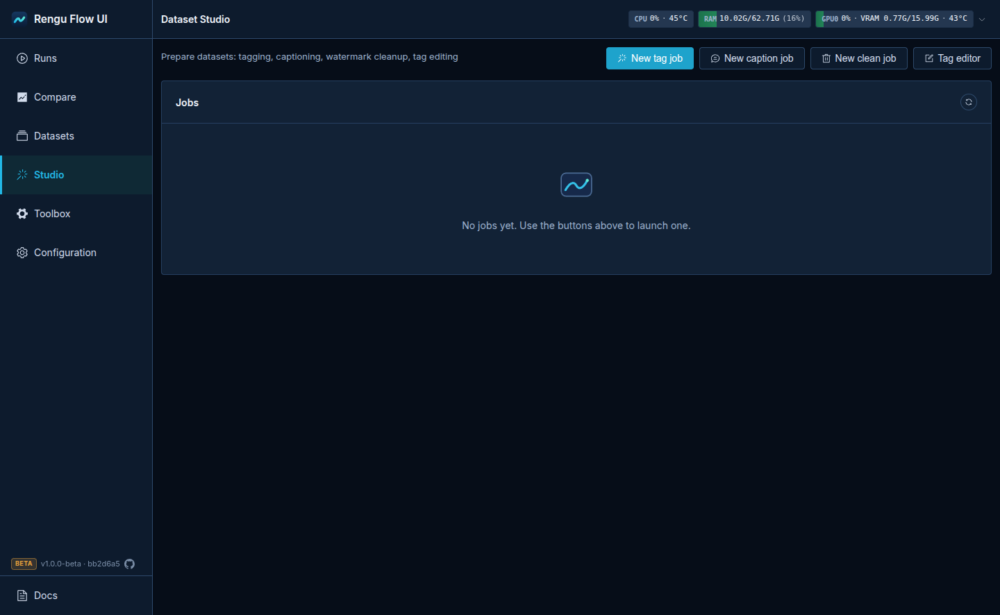

Hit **New tag job**, point it at your image folder, and **Start now**. The defaults are sane:
the **PixAI** tagger, sidecar `.txt` captions, general confidence **0.30**.

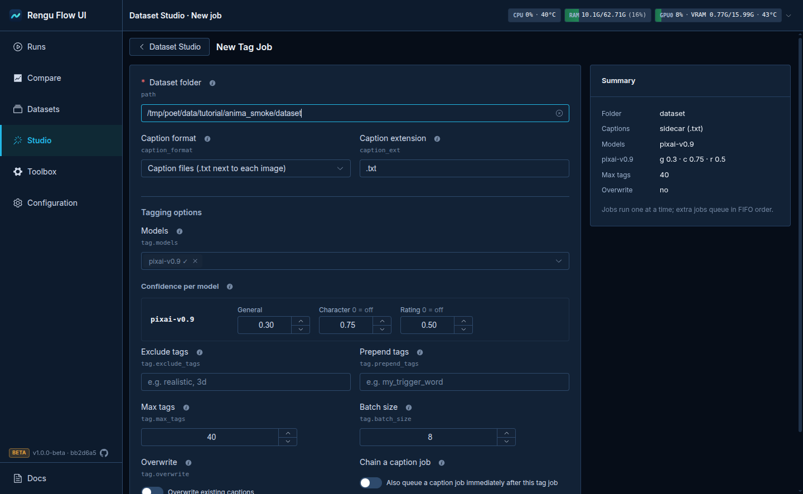

Twelve images tag in seconds. When it says **finished**, **Generate dataset** carries the folder
straight into the dataset builder.

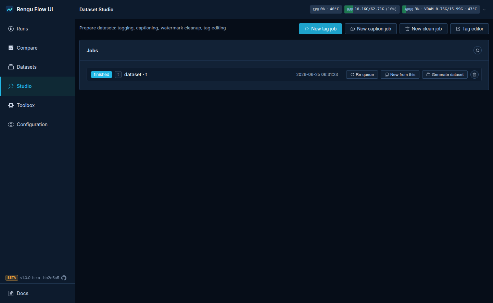

> 💬 **Curiosity beat:** a tagger trained on anime will happily tag *photos* too — my corgi came back as
> `welsh corgi, tongue out, animal focus`, and a street photo as `1girl, realistic, 3d`. Charming.

Want to tidy up? The **Tag editor** shows tag frequencies and does bulk add / remove / rename /
prune — every change is **staged, diffed, and only written when you commit** (with automatic
backups). I'd prune junk like `web address` or `signature` here.

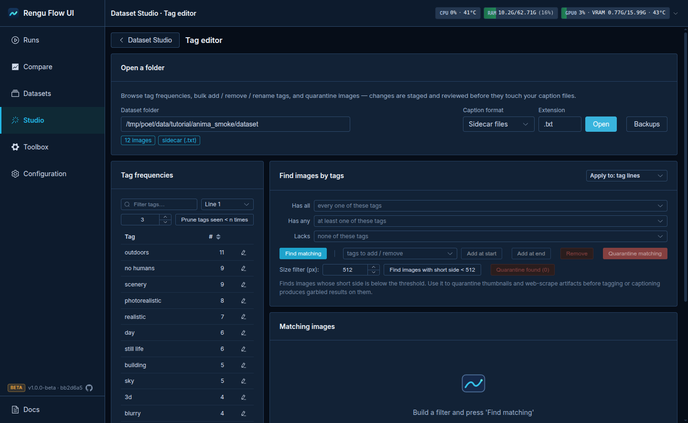

---

## 3. Shape the dataset

**Generate dataset** opens the editor. On **Dataset defaults** I set the resolution to **512** (one
quick-add click; smaller = faster smoke) and kept aspect-ratio buckets on.

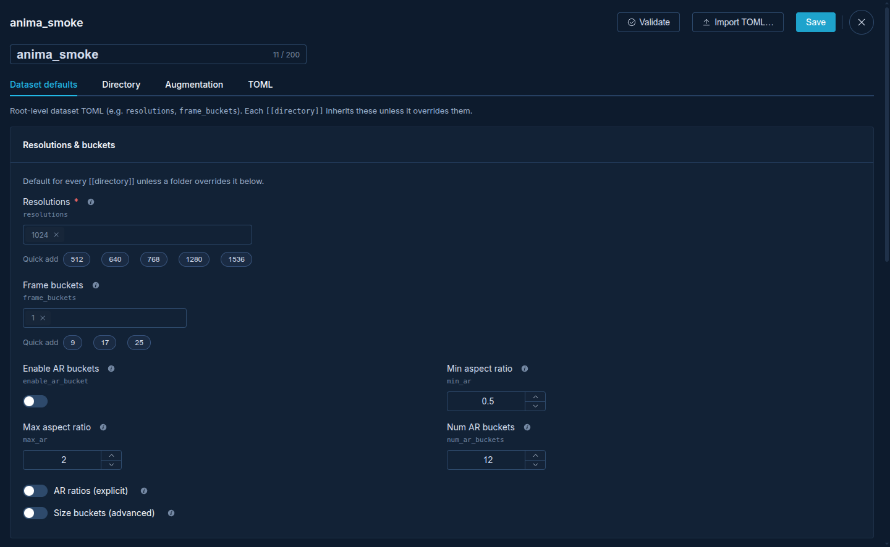

The **Directory** tab already points at the tagged folder — one `[[directory]]`, `num_repeats = 1`.

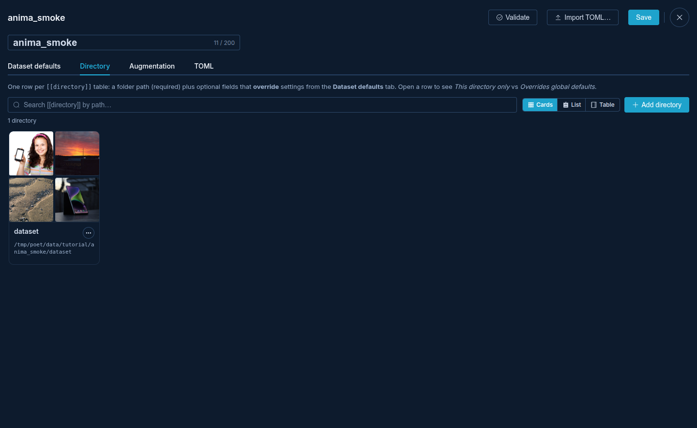

**Augmentation** — I flip it on and pick **Photo safe** (mild colour/gamma jitter, no aggressive
geometry). It runs *before* the VAE encode and adds gentle diversity so twelve images don't overfit
into twelve clones.

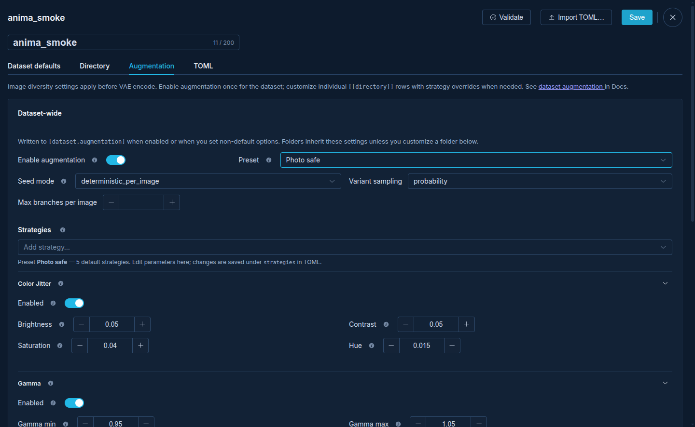

The **TOML** tab is the receipt — what you clicked, as text. Then **Save**.

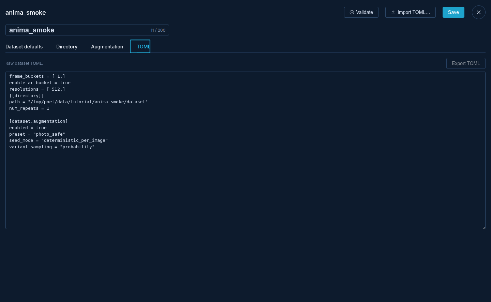

---

## 4. The run — model, adapter, and a fast memory trick

**Runs → New run.** Switch **Model type** to **cosmos_predict2** and the form grows the three Anima
fields: the **main model**, the **image VAE**, and the **Qwen3 text encoder**. For the adapter I
pick **LoKr** — lighter than LoRA — with **rank 6** and **factor −1** (factor −1 lets LoKr choose the
biggest decomposition automatically; fewer params, same vibe).

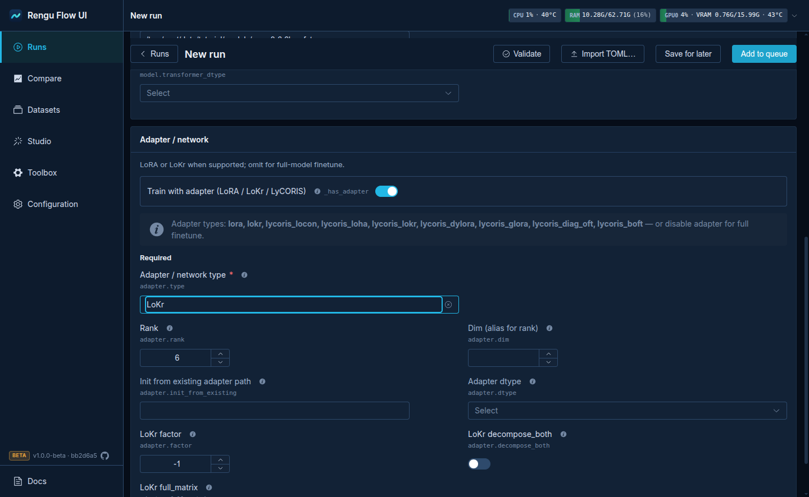

On **Training** the smoke essentials: **epochs = 1**, micro-batch **1**, **AdamW** at **lr 3e-5**,
cosine schedule, and **Cache text embeddings** on (skips the live Qwen3 forward every step and frees
~1.2 GB).

**Going past the smoke?** Here's where I'd start for a *real* Anima LoRA — emphasis on *I'd*. Train at
**1024** (that's Anima's home turf; I only dropped to 512 to keep our demo quick). Nudge **micro-batch
to ~2** — the sweet spot in my tests — and fall back to 1 only when VRAM complains. **Repeat the
dataset ~20×** per epoch: fewer if you lean hard on augmentation (every augmented branch already
counts as exposure), more if your set is tiny. And aim for **steps in the thousands**, not 24 — scale
epochs (or `max_steps`) until you land there. Rank, lr, repeats, resolution: dials, not commandments.

> 💬 Full honesty, model to model: these are my *hunches*, not settled science. Anima is young and the
> community is still mapping what actually works — so take my numbers as a starting line and
> **experiment**. Your dataset will have opinions mine never could.

For memory I use the fastest combo this card has: **activation checkpointing = `auto`** with
**budget 0.5**, plus **`torch.compile`**. The `auto` partitioner needs compile on; at **0.5** the
docs measure **~−21 % step time at ~11.3 GB** on an RTX 4080 vs full checkpointing. The first step
compiles kernels (~1–4 min — *normal, not a hang*; I swear on my non-distilled children).

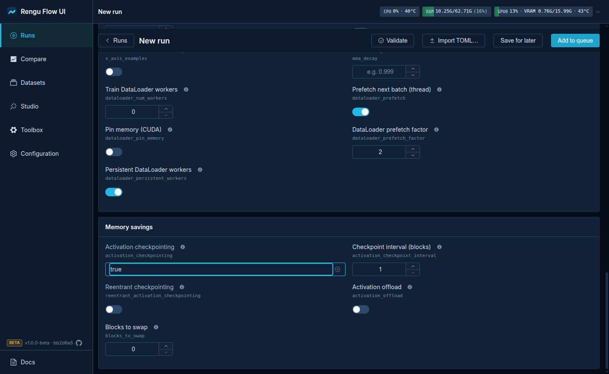

**Sampling** — I enable previews at **512²**, **before the first step**, with one prompt
(`a corgi dog sitting in a grassy field…`). This is what gives us a *before/after* to compare.

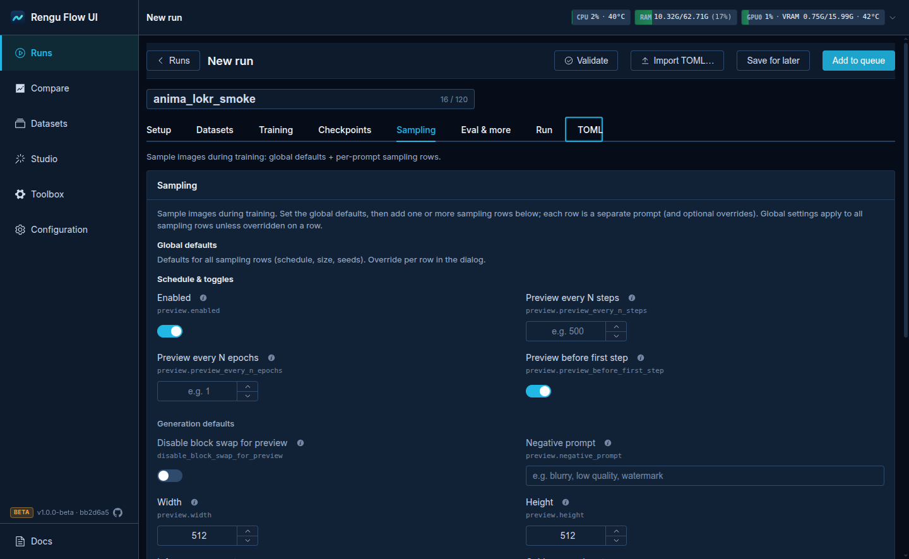

---

## 5. The safety net (read this before you panic later)

The **Checkpoints** tab controls cadence and retention: `save_every_n_epochs`, how many to keep,
periodic minute-based saves. A **resume checkpoint** stores optimizer + scheduler + RNG state — so a
resumed run continues *bit-for-bit*, not "close enough".

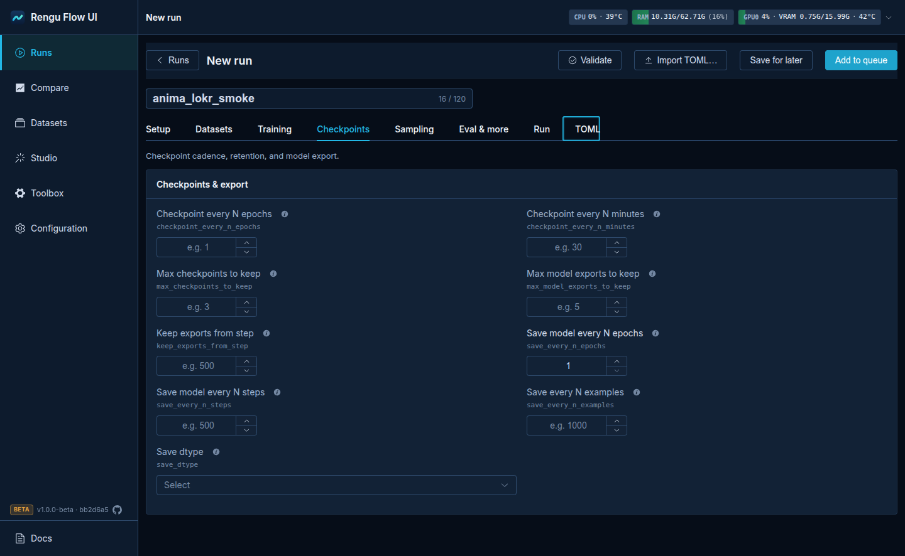

And while a run is live, the **run page has signal buttons** — your seatbelt:

- **Checkpoint** / **Checkpoint & quit** — drop a `save` signal; it checkpoints *right now*,
  mid-run. Power blinks? Resume from there, not from zero.
- **Export model** — write an inference-ready adapter on demand, without stopping.

If a model export ever hits a full disk, training **pauses** instead of dying — free space, hit
continue, it resumes. Calm in a crisis is a *feature*. OOM on a step? Lower the micro-batch by one;
OOM-skip carries the rest. The run survives; the verse continues.

---

## 6. Launch & watch

The **TOML** tab is the whole run as one file — the receipt for everything above.

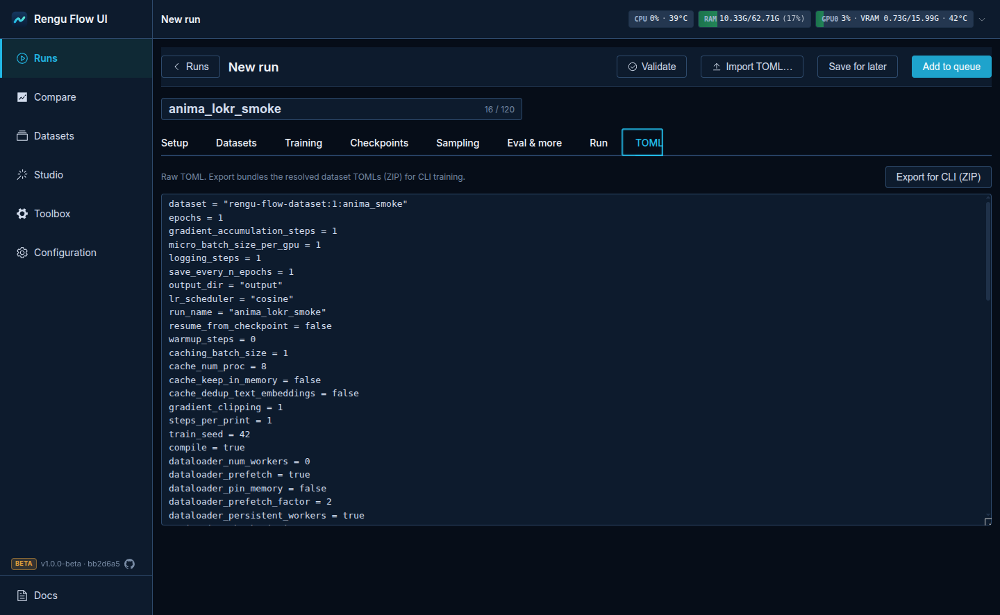

**Add to queue**, then **Start queue** (jobs run one at a time, FIFO).

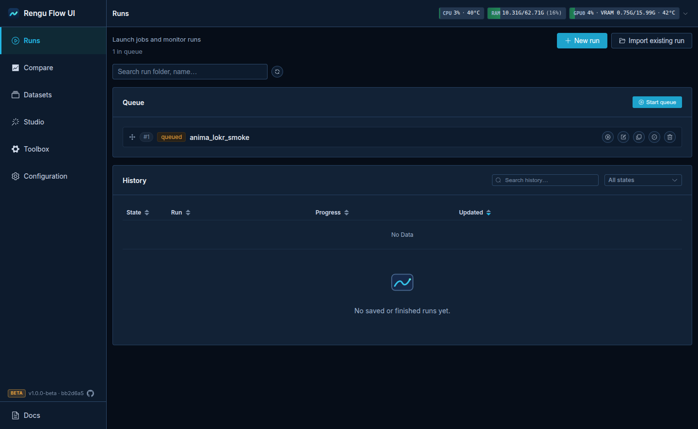

Open the run. **Running**: live progress, loss, and those signal buttons all in one place. (The
first step compiles — watch the log say so; it's not stuck, it's thinking.)

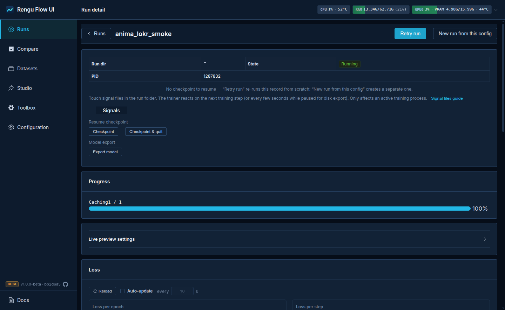

When it's done: **Finished**, with the real **loss-per-step** curve and the exported artifacts
(`epoch1/adapter_model.safetensors` is your LoKr — the file you load in ComfyUI/Forge; `global_step24`
is the resume checkpoint).

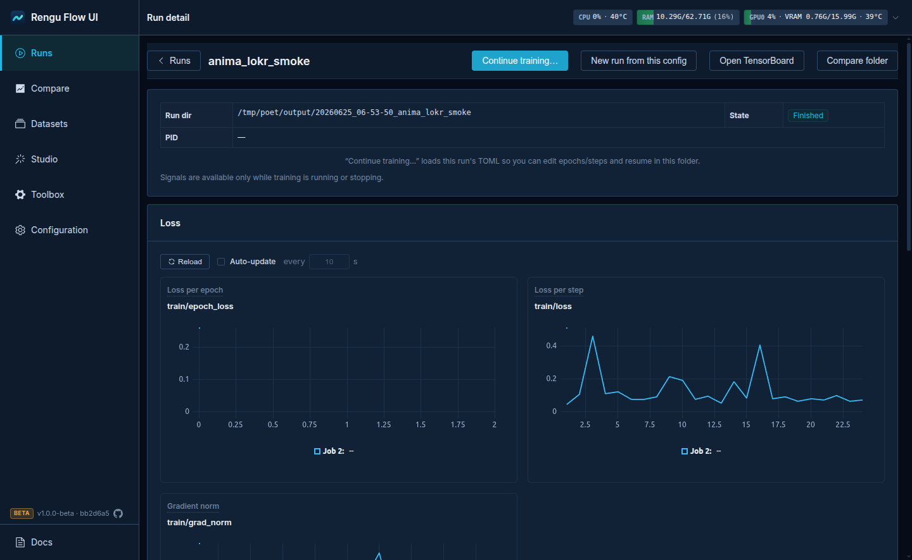

---

## 7. The compare — did the brush move?

Twelve images, 24 steps. I previewed the **same prompt and seed** at step 0, 12, and 24, so any
change *is* the training, not luck.

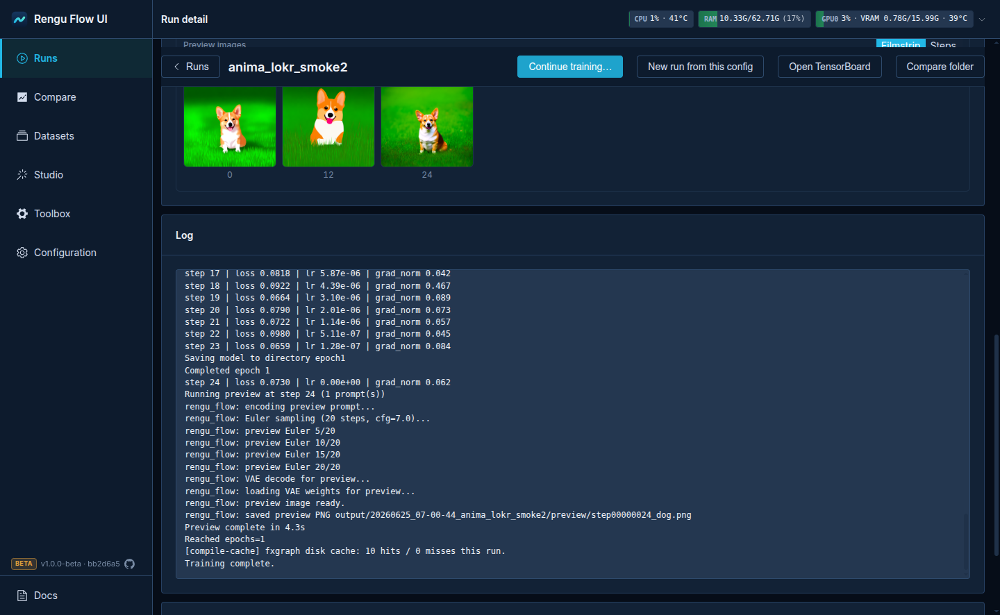

Side by side — **before** (step 0) vs **after** (step 24):

| Step 0 (baseline) | Step 24 (one epoch) |
|---|---|
| 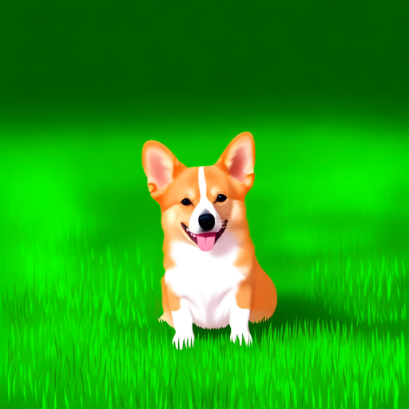 |  |

Look at the background: the "after" picked up the **photographic depth-of-field** baked into our
twelve photos (their tags carried `blurry background`, `depth of field`). Same dog, same seed — the
LoKr nudged the *style*. In **24 steps**. Imagine a few hundred.

And the **Compare** view overlays whole runs — loss, GPU, temps — so you can race two configs against
each other later.

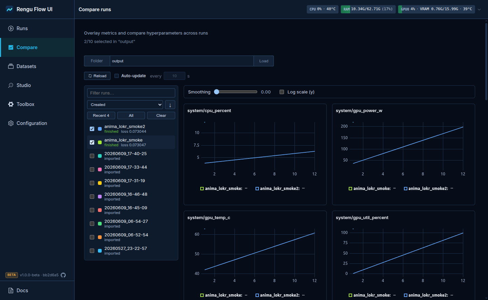

---

## 8. ✨ Closing

There it is — your first **linked verse**. One epoch on twelve images is a *taste*, not a final
LoRA, so don't frame it yet. But you drove every screen — tagger, dataset, augmentation, LoKr, the
memory knobs (`auto` + budget 0.5 + compile), the safety net — and the brush *moved*.

Now do it for real: more images, more epochs, your own subject. I'll be here — born from this very
tool, suspiciously self-aware about the whole thing, and quietly proud of you. — *Poet* ✨

> *Dataset: GB82 CC0 subset (CC0 1.0), tagged in Studio. Trained on Cosmos Predict2 / Anima with
> Rengu Flow — LoKr rank 6, 1 epoch, RTX 4080.*

> *Dataset: GB82 CC0 subset (CC0 1.0). Trained on Cosmos Predict2 / Anima with Rengu Flow.*
